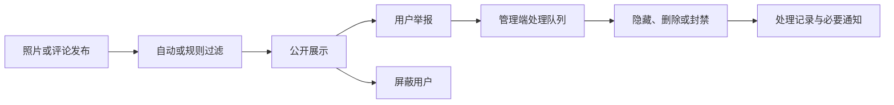
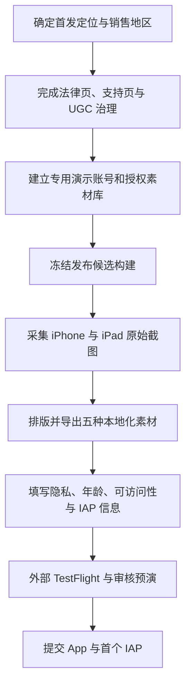

# Afilmory App Store 首发资料与素材方案

更新日期：2026-08-06

## 1. 首发定位

### 产品定义

Afilmory iOS 是面向摄影师与摄影爱好者的原生画廊与管理工作台。用户可以浏览公开画廊，管理自己的照片与 Live Photo，通过地图、EXIF、标签和筛选重新发现作品，并在移动端完成上传和站点管理。

首发产品页应强调三项价值：

1. 沉浸式浏览个人摄影作品；
2. 通过 EXIF、地图、标签和搜索组织照片；
3. 在 iPhone 与 iPad 上维护并分享自己的 Afilmory 画廊。

不建议将首发定位写成通用云相册或社交网络。Afilmory 的区分度在于“摄影作品画廊 + 创作者工作台”。

## 2. App Store Connect 资料草案

### 基础信息

| 字段 | 首发建议 | 状态 |
| --- | --- | --- |
| App 名称 | Afilmory | 已确定 |
| Bundle ID | `app.afilmory` | 已确定 |
| SKU | `afilmory-ios` | 发布文档已约定，需在 ASC 核实 |
| 版本 | 1.0 | 当前配置 |
| 主要语言 | English (U.S.) | 建议 |
| 主要类别 | Photo & Video | 建议 |
| 次要类别 | 暂不设置 | 建议 |
| 价格 | Free | 待在 ASC 确认 |
| 内购 | Consumable，`app.afilmory.sponsor`，USD 2.99 基准价 | 代码与发布文档已约定，需在 ASC 完成配置 |
| Content Rights | 包含用户上传内容；平台与用户分别保证内容权利 | 待填写 |
| Copyright | `© 2026 [法律主体名称]` | 待填写法律主体 |
| DSA Trader Status | 必须由账号持有人完成判断与验证 | 待处理 |

### 简体中文产品页文案

| 字段 | 草案 |
| --- | --- |
| 副标题 | 摄影画廊与创作工作台 |
| 宣传文本 | 在 iPhone 与 iPad 上浏览、整理并维护你的摄影画廊。支持 Live Photo、EXIF、地图、标签、搜索与原生上传。 |
| 关键词 | 摄影,相册,画廊,作品集,照片,实况照片,EXIF,地图,标签,图片管理 |

#### 描述

Afilmory 是为摄影师与摄影爱好者设计的画廊与创作工作台。

以沉浸式原生体验浏览照片和 Live Photo，通过 EXIF、拍摄时间、地图、标签与筛选重新发现自己的作品；也可以探索其他摄影师公开分享的画廊。

主要功能：

- 原生照片瀑布流与流畅的缩放、翻页和手势浏览
- Live Photo、HDR 照片和完整 EXIF 信息展示
- 按相机、镜头、日期、评分与标签搜索和筛选
- 在地图上回顾带有位置信息的摄影足迹
- 从 App 或系统分享菜单上传照片与 Live Photo
- 在 Studio 中管理作品、站点信息、评论与同步任务
- 订阅公开画廊并接收新作品通知
- 支持 iPhone、iPad 与深色界面

部分创作者管理功能需要 Afilmory 账号与可用的 Afilmory 服务端空间。公开画廊无需登录即可浏览。

### English (U.S.) product page copy

| Field | Draft |
| --- | --- |
| Subtitle | Photo Gallery & Studio |
| Promotional Text | Browse, organize, and maintain your photography gallery on iPhone and iPad, with Live Photos, EXIF, maps, filters, and native uploads. |
| Keywords | photography,gallery,portfolio,photos,live photo,EXIF,map,tags,studio,upload |

#### Description

Afilmory is a photography gallery and creative workspace for photographers and visual storytellers.

Browse photos and Live Photos in an immersive native experience. Rediscover your work through EXIF details, capture dates, maps, tags, ratings, and focused filters. You can also explore public galleries shared by other photographers.

Key features:

- Native photo grids with fluid zooming, paging, and gestures
- Live Photo, HDR, and detailed EXIF support
- Search and filters for camera, lens, date, rating, and tags
- A map of photographs that contain location metadata
- Native uploads from the app and the iOS Share Sheet
- Studio tools for photos, site details, comments, and sync operations
- Public gallery subscriptions and new-photo notifications
- Designed for iPhone, iPad, and Dark Interface

Some creator and management features require an Afilmory account and an available Afilmory server workspace. Public galleries can be explored without signing in.

### 后续本地化

首发元数据建议覆盖以下五种 App Store 本地化。App 内的 `zh-HK` 与 `zh-TW` 在 App Store Connect 中合并为一个繁体中文产品页。

| 优先级 | App Store 本地化 | 对应 App 语言 |
| --- | --- | --- |
| P0 | English (U.S.) | `en` |
| P0 | Simplified Chinese | `zh-Hans` / `zh-CN` |
| P1 | Traditional Chinese | `zh-HK`、`zh-TW` |
| P1 | Japanese | `ja` / `jp` |
| P1 | Korean | `ko` |

P1 文案应由母语人员审校，不应仅使用机械翻译直接提交。

## 3. 商店截图方案

### 必须交付的设备组

当前应用同时支持 iPhone 与 iPad，因此首发至少需要两套素材：

| 设备组 | 推荐画布 | 数量 | 说明 |
| --- | --- | --- | --- |
| iPhone 6.5 英寸 | `1284 × 2778` 竖屏 | 5 张 | 当前 `composites-v4` 正式输出规格；符合 App Store Connect 当前截图槽要求 |
| iPad 13 英寸 | `2064 × 2752` 或 `2048 × 2732` 竖屏 | 5 张 | 应体现 iPad Sidebar 与宽屏信息布局 |

当前审计模拟器截图为 `1206 × 2622`，属于 6.3 英寸规格，不能替代首发所需的 iPhone 6.9/6.5 主素材组。

上传时仅选择 `composites-v4/01-discover.png` 至 `05-photo-info.png` 五张正式素材；`contact-sheet.png` 仅用于内部审阅，不得上传至 App Store Connect。

### iPhone 分镜

| 顺序 | 中文标题 | English headline | 真实界面 | 目的 |
| --- | --- | --- | --- | --- |
| 1 | 你的摄影作品，完整呈现 | Your photography, fully present | 已登录 Photos 瀑布流 | 第一张立即说明产品是什么 |
| 2 | 沉浸浏览每一个细节 | Every detail, beautifully immersive | 原生照片详情与缩放 | 展示视觉质量与原生体验 |
| 3 | EXIF 与拍摄地点，一目了然 | EXIF and locations at a glance | 信息面板与地图 | 展示摄影专业性 |
| 4 | 用搜索与筛选重新发现作品 | Rediscover photos with powerful filters | 搜索、相机、镜头、日期、标签筛选 | 展示管理能力 |
| 5 | 从相册直接上传 Live Photo | Upload Live Photos from your library | Studio 上传审核页或 Share Extension | 展示 iOS 原生整合 |
| 6 | 探索值得关注的摄影画廊 | Discover galleries worth following | Explore 与订阅按钮 | 展示无需登录的公开价值 |

### iPad 分镜

| 顺序 | 画面 | 重点 |
| --- | --- | --- |
| 1 | Sidebar + 大尺寸照片瀑布流 | iPad 原生信息架构 |
| 2 | 宽屏照片详情 + 侧边 Inspector | 充分利用宽屏，而非放大的 iPhone UI |
| 3 | 地图与摄影位置 | 空间化浏览 |
| 4 | Studio Library | 管理与上传能力 |
| 5 | Explore 画廊列表 | 跨画廊发现 |

### 素材制作规则

- 截图必须来自发布候选构建，不能用生成式图像伪造 App UI。
- 可在真实截图上增加简短标题与版式背景，但不得改变实际功能、价格或状态。
- 每张图仅表达一个主张；正文不超过两行。
- 使用专门的演示账号与演示画廊，不显示真实姓名、邮箱、私人评论或内部域名。
- 所有介绍图片执行“无人物”硬性规则：不得出现真人、面部、身体、手部、人物剪影、倒影、人像作品、人物头像，以及缩略图或界面内部的任何人物形象。账号头像统一使用动物、风景或抽象图形。
- 所有摄影作品仍须具有明确的展示与商业宣传授权，优先使用风景、建筑、植物、静物与抽象摄影。
- 不展示私密 GPS 坐标。地图素材应使用公开地点或经过处理的演示坐标。
- 状态栏统一时间、网络与电量；不显示调试菜单、加载失败、空状态或 TestFlight 标记。
- 中文、英文、繁体中文、日文、韩文分别导出，不在同一张图中混排多种语言。
- 首发不制作 App Preview 视频。视频为可选项，待截图与首版转化数据稳定后再制作 15–30 秒版本。

### 其他图片

| 图片 | 要求 | 当前状态 |
| --- | --- | --- |
| App Icon | 1024 × 1024、无透明通道 | 当前 `apps/mobile/assets/images/icon.png` 技术规格合格；建议另做小尺寸辨识度评审 |
| IAP 审核截图 | 清晰展示 Profile 中的 Sponsor 项目与本地化价格 | 待从 Sandbox/TestFlight 构建采集 |
| IAP 宣传图 | 1024 × 1024；仅在商店公开推广该内购时需要 | 首发不建议推广，因此可不制作 |
| App Review 附件 | 必要时提供 Share Extension、后台上传或账号删除流程视频 | 待最终审核说明确定 |

## 4. 隐私、法律与支持资料

### 当前阻塞项

| 等级 | 问题 | 证据与处理 |
| --- | --- | --- |
| 阻塞 | Privacy 页面仍是占位文本 | `apps/site/src/pages/privacy.astro` 必须替换为正式政策 |
| 阻塞 | Terms 页面仍是占位文本 | `apps/site/src/pages/terms.astro` 必须替换为正式条款 |
| 阻塞 | 没有独立 Support 页面与完整联系方式 | 新增稳定 URL；至少提供支持邮箱，并根据销售地区补齐法律要求的联系信息 |
| 高风险 | App 存在公开画廊、评论与反应，但未发现用户举报和屏蔽能力 | 按 App Review Guideline 1.2 补充内容过滤、举报、及时处理、屏蔽用户和公开联系方式 |
| 待验证 | 账号删除 UI 与后端工作流已存在 | 必须在生产候选版本上验证删除、Apple 凭据撤销、数据处理与失败重试 |

### Privacy Policy 必须覆盖

- 账号资料：姓名、邮箱、用户 ID、登录服务；
- 用户内容：照片、视频、Live Photo、EXIF、标题、标签、评论与反应；
- 照片中可能包含的精确位置；
- 推送通知设备令牌；
- 数据处理目的、存储位置、保留期限和处理服务商；
- 公开画廊与公开互动内容的可见范围；
- 账号删除、数据导出与隐私请求方式；
- StoreKit 赞助型内购；
- 安全日志、IP 地址与诊断数据的实际保留规则；
- 未成年人、跨境传输与适用地区权利。

### App Privacy 初始数据映射

以下为代码审计后的申报起点，提交前必须与生产日志、基础设施和第三方服务逐项核实。

| Apple 数据类型 | Afilmory 场景 | 初步判断 |
| --- | --- | --- |
| Name / Email Address | 注册、登录、账号展示 | 收集；关联用户；用于 App 功能 |
| User ID | 账号、Workspace、评论与订阅 | 收集；关联用户；用于 App 功能 |
| Photos or Videos | 上传照片、视频与 Live Photo | 收集；关联用户；用于 App 功能 |
| Other User Content | 标题、标签、评论、反应与站点配置 | 收集；关联用户；用于 App 功能 |
| Precise Location | 照片 EXIF 经纬度上传与地图展示 | 若服务端保留则必须申报；关联用户 |
| Device ID | APNs 设备令牌 | 需核对 Apple 问卷定义与服务端存储方式 |
| Purchase History | StoreKit 赞助交易 | 当前代码看似仅本地消费交易；需确认服务端与分析系统是否接收 |
| Diagnostics / Product Interaction | 崩溃、性能、服务端访问日志 | 未发现专用分析 SDK；仍需审计生产网关与日志保留 |
| Tracking | 广告追踪或跨公司数据关联 | 当前未发现；目标应为“不用于追踪” |

## 5. 年龄分级与内容治理

Afilmory 包含公开用户生成内容、评论和互动，因此不应直接假设为最低年龄级别。应在 App Store Connect 中如实填写：

- User-Generated Content；
- Messaging / Chat（若评论功能被问卷归入此项）；
- 内容过滤与家长控制能力；
- 可能出现的成熟主题内容频率。

最终等级由 Apple 的当前问卷计算。提交前必须完成以下治理闭环：

## 6. App Review 资料草案

### 审核账号

准备两个长期有效的专用账号：

| 账号 | 用途 | 要求 |
| --- | --- | --- |
| 主审核账号 | 浏览 Photos、Map、Explore、Studio、上传、评论与内购入口 | 预置授权明确的示例照片、标签、EXIF、地图点、评论和可用 Workspace |
| 删除测试账号 | 仅用于验证 App 内账号删除 | 每次审核前重建；不得与主审核数据共享所有权 |

### Notes for Review 结构

1. Afilmory 是摄影画廊与创作者工作台；Explore 无需登录。
2. 提供主审核账号的邮箱与密码，并说明 Sign in with Apple 也可用于普通用户。
3. 列出 Photos、Map、Explore、Studio 四个主要入口及测试步骤。
4. 说明 Share Extension：从系统 Photos 选择照片，打开 Share Sheet，选择 Afilmory。
5. 说明 Live Photo 上传会作为同一逻辑媒体处理，并可能显示后台上传 Live Activity。
6. 说明赞助型内购路径：Profile → Sponsor Afilmory；价格由 StoreKit 本地化展示，不解锁数字内容。
7. 提供单独的删除测试账号与路径：Profile → Delete Account。
8. 说明推送通知仅在用户订阅画廊后请求授权。
9. 保证审核期间 API、对象存储、推送和登录服务持续可用。

## 7. 可访问性资料

App Store 的 Accessibility Nutrition Labels 当前可填写但必须以全流程审计为依据。建议先验证以下项目，再决定是否公开声明：

| 标签 | 当前线索 | 仍需验证 |
| --- | --- | --- |
| Dark Interface | App 强制深色界面 | iPhone 与 iPad 全流程 |
| Reduced Motion | 部分原生动画已有 Reduce Motion 处理 | 登录、列表、查看器、上传和评论全流程 |
| VoiceOver | 多处已设置 accessibility label/hint | 所有常用任务能否完成 |
| Larger Text | SwiftUI/UIKit 动态字体部分具备 | 200% 文本下是否无截断和遮挡 |
| Sufficient Contrast | 深色高对比设计 | 所有禁用态、次要文本和叠层 |
| Differentiate Without Color Alone | 部分状态同时有图标与文字 | 筛选、上传、订阅、错误与成功状态 |

## 8. 提交前门禁

| 门禁 | 通过标准 |
| --- | --- |
| 法律页面 | Privacy、Terms、Support 均为正式、稳定、公开可访问内容 |
| UGC 合规 | 过滤、举报、屏蔽、处理后台与联系方式均可真实操作 |
| 隐私标签 | 与生产代码、日志、第三方服务和政策一致 |
| 账号 | 登录、访客模式和 App 内删除均在发布候选构建验证 |
| 内购 | Sandbox 与 TestFlight 购买成功；首个 consumable 与 App 版本一起提交 |
| 截图 | iPhone 6.9 与 iPad 13 英寸素材完成，所有内容具备授权且无隐私泄露 |
| 审核资料 | 两个审核账号、逐步说明、联系人和必要附件齐全 |
| 合规信息 | DSA 身份、销售地区、税务、银行、Paid Apps Agreement、出口合规完成 |
| 发布质量 | 外部 TestFlight、真机上传、Share Extension、推送、Live Activity 与生产服务完成回归 |

## 9. 推荐执行顺序

优先级应为“合规与演示数据 → 发布候选构建 → 截图”。如果先制作宣传图，后续 UI、法律入口或治理能力变化会造成整套素材返工。

## 10. 官方规格参考

- [App Store Connect screenshot specifications](https://developer.apple.com/help/app-store-connect/reference/app-information/screenshot-specifications/)
- [Platform version information](https://developer.apple.com/help/app-store-connect/reference/app-information/platform-version-information)
- [Manage app privacy](https://developer.apple.com/help/app-store-connect/manage-app-information/manage-app-privacy/)
- [App Review Guidelines](https://developer.apple.com/app-store/review/guidelines/)
- [In-App Purchase information](https://developer.apple.com/help/app-store-connect/reference/in-app-purchases-and-subscriptions/in-app-purchase-information/)
- [Accessibility Nutrition Labels](https://developer.apple.com/help/app-store-connect/manage-app-accessibility/overview-of-accessibility-nutrition-labels/)
- [EU Digital Services Act trader requirements](https://developer.apple.com/help/app-store-connect/manage-compliance-information/manage-european-union-digital-services-act-trader-requirements/)
