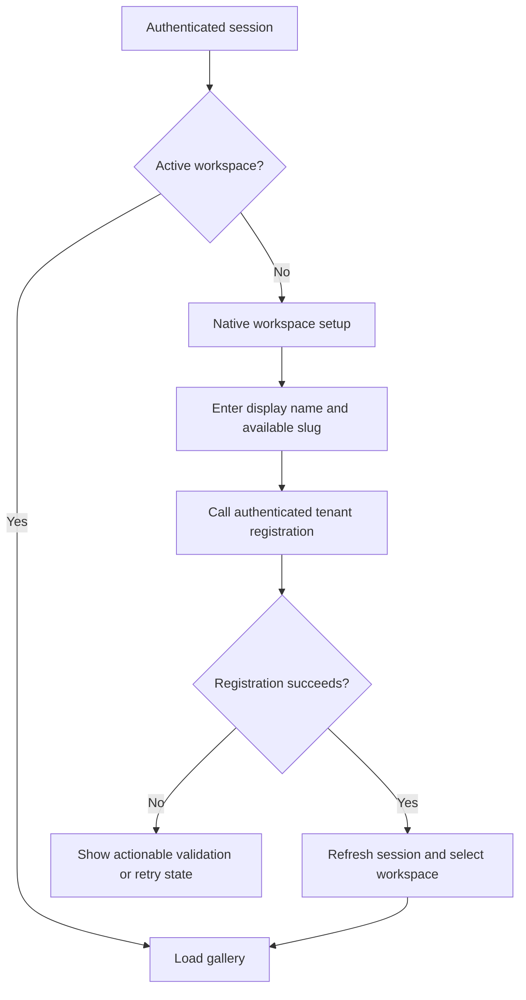
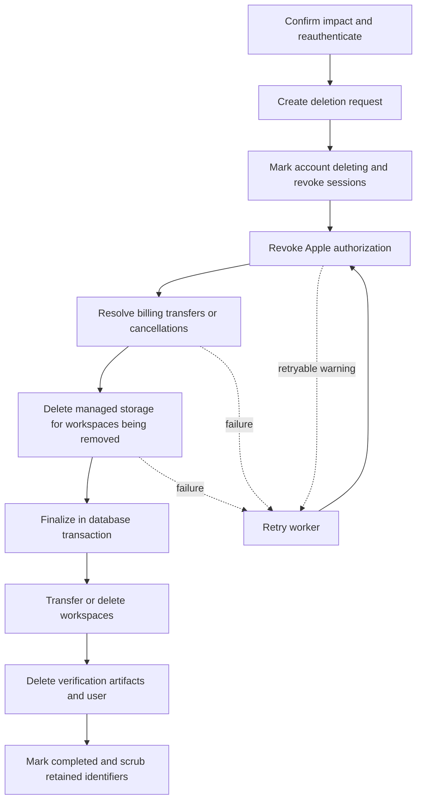

# iOS App Store Authentication Compliance — Design

- **Original date:** 2026-08-03
- **Revised:** 2026-08-04
- **Status:** Implemented in the repository; deployment configuration and physical-device/TestFlight acceptance remain
- **Scope:** Unblock the first App Store submission by providing review credentials, an equivalent privacy-preserving login option, in-app account deletion, a complete native path for newly created accounts, and optional Apple login on the administration dashboard.

## Problem

The current mobile application has four connected review risks:

| Guideline or concern          | Current behavior                                                                                                 | Required outcome                                                                                      |
| ----------------------------- | ---------------------------------------------------------------------------------------------------------------- | ----------------------------------------------------------------------------------------------------- |
| App Review Guideline 2.1      | Reviewers must use Google or GitHub and may encounter an external verification challenge.                        | Provide a stable email/password review account with representative data.                              |
| App Review Guideline 4.8      | Google and GitHub are offered as primary account login services without an equivalent privacy-preserving option. | Add native Sign in with Apple.                                                                        |
| App Review Guideline 5.1.1(v) | The application creates accounts but exposes no in-app account-deletion path.                                    | Expose authenticated deletion from the application, including when the user has no active workspace.  |
| First-use completeness        | A new social identity has no membership and reaches the native pending state without a recovery action.          | Provide minimal in-app workspace creation and retain account access independently of workspace state. |

The regulatory interpretation is based on the current [App Review Guidelines](https://developer.apple.com/app-store/review/guidelines/), Apple's [account deletion requirements](https://developer.apple.com/support/offering-account-deletion-in-your-app), and Apple's [token-revocation guidance](https://developer.apple.com/documentation/technotes/tn3194-handling-account-deletions-and-revoking-tokens-for-sign-in-with-apple).

## Current-System Findings

The design must reflect the following implementation boundaries:

1. `uq_tenant_membership_active_owner` permits at most one active owner. It does not imply that an owned workspace has no administrators or members.
2. Social identity registration is platform-global and does not create a tenant membership. A new Apple user therefore has no owned pending tenant by default.
3. `AuthRegistrationService.registerTenant` already supports a signed-in account without an active tenant. Native workspace creation can reuse this service and does not require a web-only subdomain flow.
4. The workspace-less state is owned by `PhotosHomeController.swift`, where `showPending()` currently has no action. The previously referenced `PhotosHomeScreen.tsx` does not exist.
5. Profile presentation currently requires a session, active workspace, and loaded feed. Account settings and account deletion therefore become inaccessible precisely in the workspace-less case.
6. Better Auth invokes `beforeDelete` before deleting the user, accounts, and sessions, but these operations do not share one transaction with external Apple, Creem, or object-storage calls. A hook cannot provide the claimed all-or-nothing semantics.
7. `SystemSettingStore` stores values directly in JSONB. The `isSensitive` field is presentation metadata, not encryption.

## Design Decisions

| Area                   | Decision                                                                                                                     | Rationale                                                                                                                             |
| ---------------------- | ---------------------------------------------------------------------------------------------------------------------------- | ------------------------------------------------------------------------------------------------------------------------------------- |
| Review credentials     | Add email/password sign-in, but not public email/password registration.                                                      | Review receives a stable account without expanding scope to verification mail and password recovery.                                  |
| Apple login            | Use `expo-apple-authentication` and the system `AppleAuthenticationButton`.                                                  | Provides the native authorization sheet and Apple-standard control semantics.                                                         |
| Administration login   | Keep email/password login and expose Apple through the existing dynamic provider list only when a Services ID is configured. | Preserves the review-account path while allowing the dashboard to share the verified Apple provider without enabling it accidentally. |
| Button hierarchy       | Make Apple prominent and no smaller than competing login buttons; it need not be the first control.                          | This follows Apple's prominence requirement without inventing a stricter ordering rule.                                               |
| New-user path          | Add minimal authenticated workspace creation in the mobile app.                                                              | A newly created Apple identity must not end at an external-browser dead end.                                                          |
| Account access         | Make account settings session-scoped, not workspace-scoped.                                                                  | Sign-out, deletion, and identity information must remain available without an active workspace or feed.                               |
| Deletion orchestration | Implement a durable, idempotent account-deletion workflow instead of relying on Better Auth `beforeDelete`.                  | External effects cannot participate in the database transaction and require retryable recovery.                                       |
| Deletion authorization | Require explicit recent proof of identity.                                                                                   | `session.freshAge: 0` is not a substitute for a deliberate destructive-action challenge.                                              |
| Shared workspaces      | Transfer ownership deterministically when other active members exist; delete only when no other active member exists.        | Account deletion must not destroy other users' workspace data or leave an ownerless workspace.                                        |
| Apple private key      | Load the `.p8` value from an environment secret or deployment secret manager.                                                | The current system-setting store does not encrypt secrets.                                                                            |
| Apple refresh token    | Persist it in a dedicated encrypted authorization record.                                                                    | A revocable credential is required after the one-time authorization-code exchange and must not be stored as plaintext.                |
| Completion model       | Revoke access immediately, then allow deletion to complete asynchronously with visible status.                               | Apple permits asynchronous completion when the user is informed; this supports reliable retries without restoring account access.     |

## Sign in with Apple

### Application and Server Configuration

The iOS application must add:

- `ios.usesAppleSignIn: true` in `apps/mobile/app.json`;
- the `expo-apple-authentication` config plugin;
- the `expo-apple-authentication` package;
- the Sign in with Apple capability in the App ID and provisioning profile.

The backend Apple provider configuration consists of:

| Value                 | Storage                                                    | Notes                                                                                  |
| --------------------- | ---------------------------------------------------------- | -------------------------------------------------------------------------------------- |
| App bundle identifier | Non-secret system setting or environment variable          | Native audience and token-exchange client ID; use `app.afilmory`.                      |
| Services ID           | Optional non-secret system setting or environment variable | Enables Apple on the administration dashboard; when absent, Apple remains native-only. |
| Team ID               | Non-secret system setting or environment variable          | Used to generate the Apple client-secret JWT.                                          |
| Key ID                | Non-secret system setting or environment variable          | Identifies the Apple signing key.                                                      |
| `.p8` private key     | Environment secret or deployment secret manager only       | Never expose it through the current settings UI or store it in settings JSONB.         |

The backend generates the ES256 client-secret JWT on demand and caches it for a bounded duration below Apple's maximum validity. If the Better Auth Apple flow requires it, include `https://appleid.apple.com` in `trustedOrigins`. The administration dashboard continues to support email/password review credentials; its existing social-login UI receives Apple only when the optional Services ID makes the web flow operational. Because Apple returns web authorization with `response_mode=form_post`, the OAuth Gateway validates the wrapped state from the form body and uses a 307 redirect to preserve the one-time authorization payload for Core's existing POST callback handler.

### Native Authorization Flow

The client uses `AppleAuthentication.isAvailableAsync()` before rendering the system button. The authorization request includes a cryptographically random raw nonce and local state. The same raw nonce is passed to Better Auth; the client validates returned state before continuing.

```mermaid
sequenceDiagram
  participant U as User
  participant M as iOS application
  participant A as Apple
  participant B as Afilmory API

  U->>M: Select Sign in with Apple
  M->>A: Native authorization request with nonce and state
  A-->>M: Identity token and authorization code
  M->>M: Validate state
  M->>B: Sign in with identity token and raw nonce
  B->>B: Validate issuer, audience, nonce, and Apple subject
  B-->>M: Afilmory session
  M->>B: Exchange authorization code
  B->>A: Exchange code using generated client secret
  A-->>B: Refresh token and token response
  B->>B: Match subject and audience; encrypt refresh token
  B-->>M: Authorization linked
```

The authorization-code exchange endpoint must not bind a refresh token merely because the caller has a valid session. It must:

1. consume a one-time authorization code;
2. validate the token response issuer and audience;
3. verify that the returned Apple `sub` matches both the original identity token and the caller's linked Apple account;
4. verify nonce continuity where Apple returns the relevant claim;
5. reject subject mismatch and code replay;
6. encrypt the refresh token before persistence.

The dedicated Apple authorization record should contain the linked user/account identifier, Apple subject, client ID, encrypted refresh token, lifecycle status, and timestamps. Encryption keys remain deployment secrets. Direct plaintext updates to `authAccounts.refreshToken` are prohibited.

### Apple Profile and Revocation Edge Cases

Apple may provide email and full name only on the first authorization. The provider mapping must therefore:

- persist first-authorization name and email when present;
- identify returning users by the validated Apple subject;
- recover the already persisted account email when a later identity token omits email;
- avoid treating missing email on a returning authorization as a new invalid account.

The mobile application also registers `AppleAuthentication.addRevokeListener`. A revocation event clears the native Keychain session, clears the JavaScript SecureStore/cookie state through the authentication bridge, and returns the user to the signed-out state. Credential-state checks may be performed when the application becomes active, but must not replace server-side session validation.

## Native Workspace Onboarding and Account Access

A newly authenticated user without an active membership remains inside the application:



The initial mobile form is intentionally narrow: workspace display name and slug, validation, submit, retry, and sign-out. It does not include billing, advanced site configuration, storage configuration, or domain setup.

`PhotosHomeController.showPending()` receives actions for workspace creation and account settings. Account settings are presented from session-level state even when `activeWorkspace` or `PhotoFeedStore` is absent. The profile/account sheet must not require gallery data to render identity, sign-out, or deletion controls.

## Account Deletion

### User Experience and Authorization

Account settings expose a destructive **Delete account** action. Before confirmation, the client requests a deletion-impact summary containing:

- workspaces that will be deleted;
- shared workspaces whose ownership will be transferred and the proposed recipient;
- subscriptions that will be transferred, cancelled, or downgraded;
- the fact that comments, reactions, subscriptions, and device registrations associated with the user will be removed.

The final confirmation requires recent identity proof:

| Account type             | Required proof                                                                                                            |
| ------------------------ | ------------------------------------------------------------------------------------------------------------------------- |
| Credential account       | Current password.                                                                                                         |
| Apple account            | Fresh Sign in with Apple authorization bound to the same Apple subject.                                                   |
| Other OAuth-only account | Provider reauthorization when supported; otherwise a deliberately short recent-session challenge documented per provider. |

The server, not the client, verifies the proof and recomputes the impact immediately before accepting the request.

### Durable Domain Model

Add an `accountDeletionRequests` table or equivalent deletion aggregate with:

- request ID and subject user ID while processing;
- status and current stage;
- attempt count, next-attempt timestamp, and a non-sensitive error code;
- an immutable impact snapshot sufficient to resume workspace decisions;
- references to encrypted provider-revocation material rather than plaintext tokens;
- created, updated, access-revoked, and completed timestamps.

After completion, scrub subject identifiers and provider material according to a short retention policy, retaining only the minimum non-personal operational audit record.

Suggested statuses are `requested`, `processing`, `retryable_failure`, `manual_intervention`, and `completed`. Track the independent current stage as `revoke_providers`, `resolve_billing`, `delete_storage`, or `finalize_database`. Each stage must be safe to repeat. A unique active-request constraint prevents concurrent deletion workflows for one user.

Use the existing `@afilmory/task-queue` package with its Redis driver to execute the workflow, but treat the database deletion request as the source of truth. Queue payloads contain only the request ID. A recovery scanner re-enqueues due, non-completed requests so that a process failure between database commit and queue publication cannot strand a deletion. The executor acquires a per-request database lock before advancing a stage.

### Workspace Ownership Policy

For every workspace where the deleting user is the active owner:

1. select another active administrator by oldest membership creation time;
2. if no administrator exists, select another active member by oldest membership creation time;
3. if a candidate exists, transfer ownership in one database transaction and remove the deleting user's membership during finalization;
4. if no candidate exists, delete the workspace and its tenant-scoped database data;
5. never transfer ownership to an invited, suspended, or otherwise inactive membership.

Tenant billing must not retain a deleted user's customer or payment responsibility. If the provider supports a valid billing-owner transfer, migrate it to the new owner. Otherwise cancel the external subscription and downgrade the retained workspace with explicit notification. Workspaces that are deleted always have their subscriptions cancelled before final database deletion.

### Database Integrity

The existing user cascades include at least the following tables:

| Table                  | Result of deleting `authUsers`                  |
| ---------------------- | ----------------------------------------------- |
| `tenantMemberships`    | Removes remaining memberships.                  |
| `gallerySubscriptions` | Removes followed-gallery records.               |
| `apnsDevices`          | Removes push-device registrations.              |
| `authSessions`         | Removes all sessions.                           |
| `authAccounts`         | Removes credentials and provider links.         |
| `comments`             | Removes comments authored by the user.          |
| `commentReactions`     | Removes comment reactions authored by the user. |

Additional schema work is required:

- change `comments.parentId` from a relation-only text field to a real self-referencing foreign key with `ON DELETE SET NULL`;
- audit and delete `authVerifications` whose identifier or value refers to the deleted user because this table has no user foreign key;
- preserve anonymous photo reactions, which have no user identity by design;
- rely on tenant cascades for tenant-scoped rows only after the associated external storage and billing operations have reached a safe state.

Because the application is unreleased, this schema correction should be direct. No compatibility flag or runtime repair path is required.

### Orchestration



The request transaction marks the account as deleting, revokes all current sessions, and prevents new session issuance. From this point the user cannot regain normal application access while cleanup continues.

External operations are executed by the Redis-backed account-deletion queue:

1. revoke the encrypted Apple refresh token;
2. resolve Creem subscription transfer or cancellation;
3. delete managed-storage prefixes only for workspaces selected for deletion;
4. run one final database transaction that transfers or deletes workspaces, removes verification artifacts, and deletes `authUsers`;
5. mark the request complete and scrub retained identifiers.

Apple revocation failure or a missing refresh token must not permanently block account deletion. Record the failure, continue the legally required deletion, and tell the user how to remove Afilmory under Apple Account settings. Creem and managed-storage failures remain retryable before finalization because otherwise the system could continue billing or permanently lose the identity needed to locate undeleted data. Retries use bounded exponential backoff; exhausted retries enter `manual_intervention`, emit an operational alert, and preserve the already revoked-access state until an operator resumes the same idempotent request.

The Better Auth `beforeDelete` hook may reject direct deletion calls and route them to this service, but it must not perform the external workflow or claim transactional atomicity.

### Client and Native Session Cleanup

The application currently has both JavaScript authentication state and native Keychain state. Deletion succeeds only when both are cleared.

Extend the existing native bridge with an explicit account-deletion request/result event. JavaScript remains the owner of the Better Auth client operation and resets its SecureStore/cookie state; native code clears the Keychain representation after the server accepts the deletion request. Both layers then render a signed-out state with either:

- a completion message; or
- a deletion-in-progress message when asynchronous cleanup remains.

A native-only deletion call that leaves the JavaScript session intact is not acceptable.

## Implementation Surface

| Area                                                    | Primary files or modules                                                                                                                                                                                        |
| ------------------------------------------------------- | --------------------------------------------------------------------------------------------------------------------------------------------------------------------------------------------------------------- |
| Better Auth and provider mapping                        | `be/apps/core/src/modules/platform/auth/auth.provider.ts`, `auth.controller.ts`, and related auth services                                                                                                      |
| Apple code exchange and encrypted authorization storage | New auth-owned service/controller and database schema under `be/packages/db`                                                                                                                                    |
| Account deletion                                        | New account-deletion domain services and controller, Redis-backed `@afilmory/task-queue` executor, and recovery scanner; reuse tenant data-management operations through explicit idempotent interfaces      |
| Database integrity                                      | `be/packages/db/src/schema.ts` and a generated forward migration                                                                                                                                                |
| Non-secret Apple configuration                          | `system-setting.ui-schema.ts` and configuration types; private key remains outside the settings store                                                                                                           |
| React authentication                                    | `apps/mobile/src/modules/auth/SignInSection.tsx`, `sessionStore.ts`, and localized strings                                                                                                                      |
| Administration login                                    | Existing dashboard login and `SocialAuthButtons`, backed by the dynamic Core provider list and optional Apple Services ID                                                                                       |
| Mobile application configuration                        | `apps/mobile/app.json` and `apps/mobile/package.json`                                                                                                                                                           |
| React/native bridge                                     | `apps/mobile/src/native/NativePageView.tsx` and the native view event contract                                                                                                                                  |
| Native workspace and profile entry points               | `PhotosHomeController.swift`, `PageControllerHostView.swift`, `ProfileSheetView.swift`, and supporting sheet records                                                                                            |
| Release operations                                      | `apps/mobile/RELEASE.md` and App Store Connect review metadata                                                                                                                                                  |

Custom mobile authentication endpoints use `/api/mobile-auth/apple/*`, while
account-deletion endpoints use `/api/account-deletion/*`. They intentionally do
not live below `/api/auth/*`: that namespace terminates in Better Auth's
registration-order-sensitive passthrough route and cannot safely host custom
controllers.

## Out of Scope

- Public email/password registration, verification email, password reset, and account recovery.
- Sign in with Apple for the public gallery SPA in `apps/web`.
- Billing purchase flows during native workspace onboarding.
- Advanced workspace, storage, custom-domain, and site-configuration screens.
- Unrelated authorization issues in photo reactions.

## App Review and Operations Checklist

- Confirm, rather than assume, that App ID `app.afilmory` has the Sign in with Apple capability and that the TestFlight provisioning profile includes the entitlement.
- Store the Apple `.p8` private key in the deployment secret manager and document rotation.
- Seed `review@afilmory.art` with an active workspace, representative photos including GPS metadata, and at least one comment thread.
- Provide review credentials and navigation notes in App Store Connect, including the sponsorship purchase path.
- Maintain a review-account reset or reseed runbook because reviewers may exercise account deletion. Keep a separately documented spare review account; do not special-case or disable deletion for either account.
- Keep the production API and managed media available throughout the review period.
- Update `apps/mobile/RELEASE.md`; its current statement that no additional capability is required becomes invalid after enabling Sign in with Apple.

## Verification

### Server Behavior

- A workspace-less user can request and complete account deletion.
- A sole-member owned workspace is deleted with its storage and subscription cleanup.
- A shared workspace transfers ownership to the deterministic active candidate and retains other members' data.
- Multiple owned and joined workspaces produce the correct per-workspace impact.
- Apple subject mismatch and authorization-code replay are rejected.
- A returning Apple user can sign in when Apple omits email and full name.
- The administration dashboard exposes Apple only when a Services ID is configured and always retains email/password login.
- Apple revocation failure follows the documented non-blocking fallback.
- Creem and managed-storage failures enter retryable state without issuing new sessions or committing premature database deletion.
- Repeating any deletion stage is idempotent.
- User-linked verification rows are removed and comment replies survive through `ON DELETE SET NULL`.

Use focused behavioral tests, for example:

```bash
pnpm --filter @afilmory/core exec vitest run <account-deletion-tests>
```

### Mobile Behavior

- A fresh Apple identity completes native workspace setup and reaches the gallery.
- The same Apple identity signs in a second time when Apple no longer returns email or name.
- Account settings and deletion remain reachable without an active workspace or loaded feed.
- Password and Apple reauthentication failures leave the account intact.
- An accepted deletion request clears both JavaScript and native session stores.
- Apple credential revocation returns the application to a signed-out state.
- VoiceOver identifies the system Apple button and destructive confirmation correctly.

Run the relevant static checks:

```bash
pnpm --filter @afilmory/mobile type-check
pnpm --filter @afilmory/mobile bundle
pnpm type-check
pnpm lint
```

Complete the acceptance pass on a physical device and a new TestFlight build after the entitlement and provisioning-profile changes.
