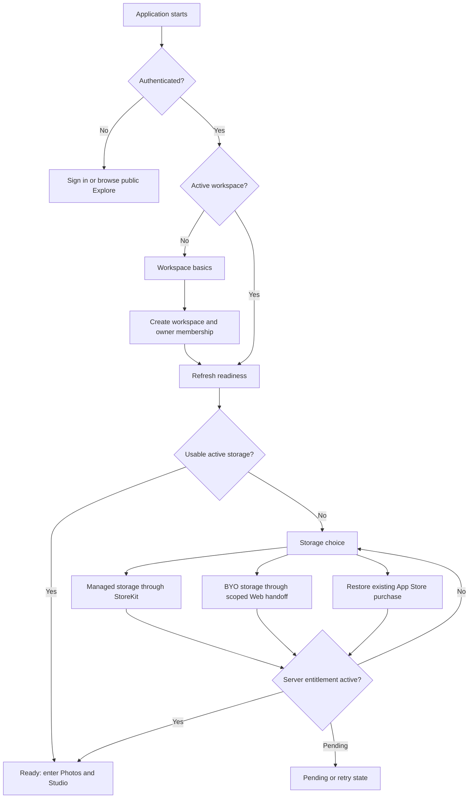
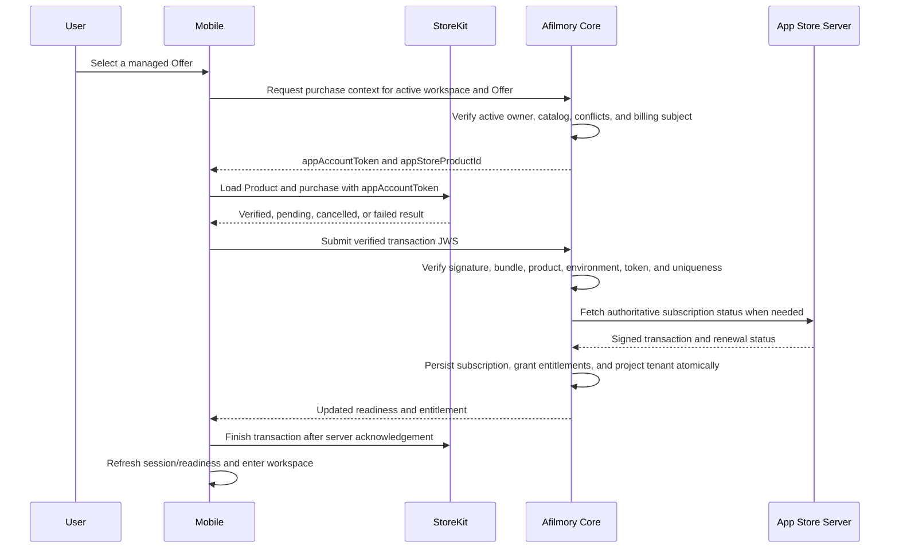
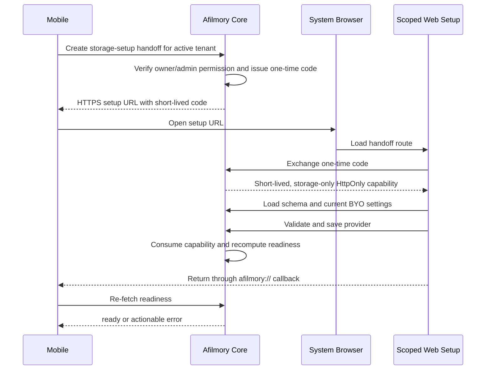

# Mobile Onboarding, StoreKit Billing, and Storage Readiness — Design

- **Original date:** 2026-08-05
- **Status:** Proposed; product direction approved, implementation not started
- **Scope:** Align Mobile onboarding with the Web onboarding outcome while keeping the native flow smaller; add App Store subscriptions alongside Creem; make billing provider-neutral; and provide a payment-free Web handoff for BYO storage configuration.
- **Supersedes:** Only the statement in `2026-08-03-ios-app-store-auth-design.md` that Mobile workspace onboarding excludes storage and billing. Its authentication, account-access, and account-deletion designs otherwise remain in force, subject to the App Store subscription amendment in this document.

## Problem

The current onboarding paths reach different operational outcomes:

| Surface | Current flow                               | Result                                                                                                                      |
| ------- | ------------------------------------------ | --------------------------------------------------------------------------------------------------------------------------- |
| Web     | Login → workspace → site settings → review | Creates an active workspace, then the dashboard separately forces `/photos/storage` when no usable storage exists.          |
| Mobile  | Sign in → workspace name and slug          | Creates an active workspace and immediately exits setup, even though the workspace may still be unable to upload any photo. |

This difference is material because both public application plans currently include zero storage. A newly created Mobile workspace is therefore administratively active but operationally incomplete.

The storage solution also has two constraints:

1. Configuring a user-owned S3-compatible bucket is too credential-heavy for the initial native implementation and is already supported by the Web dashboard.
2. Managed storage and other consumer digital entitlements purchased from iOS must use In-App Purchase. The Mobile application must not require or direct users to a Creem checkout outside the application.

The required outcome is a native onboarding flow that ends only when the selected workspace has usable storage, while preserving Web configuration for BYO storage and supporting both existing Creem subscriptions and new App Store subscriptions through one entitlement model.

## Current-System Findings

The design reflects the following verified repository boundaries:

1. The Web registration wizard contains login, workspace, site-settings, and review steps. Storage is not part of that wizard; `useRequireStorageProvider` subsequently redirects a workspace with neither a configured provider nor an active managed plan to `/photos/storage`.
2. `WorkspaceSetupScreen.tsx` accepts only a workspace name and slug. `createInitialWorkspace` refreshes the session and treats the presence of an active workspace as successful completion.
3. `AuthRegistrationService` creates an active tenant, creates an owner membership, and selects it as the session's active workspace. It does not configure storage.
4. `free` and `pro` currently declare `includedStorageBytes: 0`. A storage provider or a managed-storage entitlement is therefore required before upload can work.
5. `creem_subscription` is provider-specific. Creem webhook handling directly writes `tenant.planId` and `tenant.storagePlanId`, and revocation directly resets those fields.
6. `StoragePlanService.getActivePlanSummaryForTenant` checks only Creem subscription rows. It cannot recognize an App Store entitlement.
7. `tenant.planId` and `tenant.storagePlanId` are read directly by quota and storage services. They are useful runtime projections, but they are not sufficient as a multi-provider billing ledger.
8. Mobile already contains StoreKit 2 purchase mechanics for the consumable sponsorship product `app.afilmory.sponsor`. That flow verifies locally and immediately finishes the transaction; it has no server entitlement, renewal, refund, restore, or notification processing and cannot be reused as the subscription system without a new backend boundary.
9. The existing `/photos/storage` page includes both BYO provider configuration and a Creem-backed managed-storage purchase surface. It is not a review-safe destination for a Mobile “configure my own storage” link.
10. Platform users are global, while paid plans and storage are tenant-scoped. Only the active owner may create or replace a paid entitlement for a workspace.

## Governing Apple Requirements

The design follows the current official Apple documentation:

- [App Review Guidelines 3.1.2 and 3.1.3(b)](https://developer.apple.com/app-store/review/guidelines/) permit SaaS and cloud-support subscriptions and allow a multiplatform application to recognize Web-acquired entitlements when equivalent consumer entitlements are also available through In-App Purchase.
- [`appAccountToken`](<https://developer.apple.com/documentation/storekit/product/purchaseoption/appaccounttoken(_:)>) is a UUID supplied by the application and returned in the resulting transaction. It is the binding between an App Store transaction and an Afilmory billing subject.
- [`VerificationResult.jwsRepresentation`](https://developer.apple.com/documentation/storekit/verificationresult/jwsrepresentation-21vgo) is the signed transaction representation intended for independent server verification through the App Store Server Library.
- [`Transaction.finish()`](<https://developer.apple.com/documentation/storekit/transaction/finish()>) is called only after the purchased service has been delivered or enabled.
- [App Store Server API](https://developer.apple.com/documentation/appstoreserverapi) provides signed transaction history and current subscription status independently of a device installation.
- [App Store Server Notifications V2](https://developer.apple.com/documentation/appstoreservernotifications/app-store-server-notifications-v2) is the authoritative asynchronous update channel for renewals, billing changes, refunds, expirations, and revocations.
- [App Store Connect subscription groups](https://developer.apple.com/help/app-store-connect/manage-subscriptions/offer-auto-renewable-subscriptions) allow one active subscription product per group at a time. One coherent subscription group is the default for the first release.
- [Apple's account-deletion guidance](https://developer.apple.com/support/offering-account-deletion-in-your-app) requires an application to warn that App Store billing continues, request cancellation, and still provide an immediate deletion option.

This document defines a conservative review boundary. It does not rely on an external-purchase-link entitlement or a storefront-specific exception.

## Design Decisions

| Area                  | Decision                                                                                                                                 | Rationale                                                                                        |
| --------------------- | ---------------------------------------------------------------------------------------------------------------------------------------- | ------------------------------------------------------------------------------------------------ |
| Payment providers     | Creem remains the Web provider; StoreKit is the iOS provider.                                                                            | Each platform uses its appropriate purchase mechanism.                                           |
| Integration point     | Both providers write through a provider-neutral billing and entitlement service.                                                         | StoreKit must not emulate Creem or create synthetic `creem_subscription` rows.                   |
| Billing subject       | The paid entitlement is tenant-scoped. One App Store subscription is bound to one owner-managed workspace.                               | Existing plans, storage, and quota enforcement are tenant-scoped.                                |
| Multi-workspace limit | The first release does not support several simultaneous App Store-managed workspaces for one Apple account.                              | A single subscription group cannot represent multiple concurrent instances of the same service.  |
| Product model         | A stable internal Offer grants one or more entitlement values and maps to provider-specific product IDs.                                 | Benefits remain consistent while prices and product identifiers remain provider-owned.           |
| App Store catalog     | Use one subscription group containing a coherent tier ladder.                                                                            | Prevents accidental duplicate Apple subscriptions and supports upgrade/downgrade semantics.      |
| Public offer parity   | Every consumer entitlement exposed through Web checkout and usable in Mobile must have an equivalent IAP offer before App Store release. | Satisfies the multiplatform-services rule and reduces review ambiguity.                          |
| Onboarding completion | Derive readiness from workspace and storage facts; do not persist a generic `onboardingCompleted` flag.                                  | Derived state cannot drift from actual storage availability.                                     |
| Runtime plan fields   | Retain `tenant.planId` and `tenant.storagePlanId` as atomically updated projections.                                                     | Existing quota and storage hot paths remain simple.                                              |
| Manual plans          | Represent superadmin assignments as manual entitlement grants rather than direct projection writes.                                      | Revoking one provider must not erase a valid manual or alternate entitlement.                    |
| BYO configuration     | Open a dedicated, capability-scoped Web setup route containing no managed-storage purchase UI.                                           | Reuses the mature Web form without exposing external payment from Mobile.                        |
| Native price display  | Display StoreKit's localized product name, duration, and `displayPrice`.                                                                 | Creem pricing and server-side nominal pricing are not authoritative in an iOS purchase UI.       |
| Purchase authority    | Only an active workspace owner may request a purchase context or bind a transaction.                                                     | Prevents members from assigning billing obligations to a workspace.                              |
| Family Sharing        | Disable it for the first release.                                                                                                        | Workspace ownership and family-member Apple accounts do not have a safe entitlement mapping yet. |

## Product Offer Model

An Offer is the provider-neutral commercial unit:

```text
Offer
├── id: stable internal identifier
├── grants
│   ├── applicationPlanId: free | pro | null
│   └── storagePlanId: managed-5gb | managed-50gb | null
├── provider products
│   ├── creemProductId
│   └── appStoreProductId
└── presentation and availability metadata
```

An Offer may grant an application plan, managed storage, or both. This is necessary because the current system exposes application quotas and managed storage as separate axes, while a single App Store subscription group should present a coherent tier ladder.

The exact release catalog and pricing remain deployment decisions. A valid first-release shape could be:

| Example Offer     | Application grant                | Storage grant  | App Store relationship    |
| ----------------- | -------------------------------- | -------------- | ------------------------- |
| Managed 5 GB      | None; the default remains `free` | `managed-5gb`  | Lower subscription level  |
| Pro Managed 50 GB | `pro`                            | `managed-50gb` | Higher subscription level |

These names and capacities are illustrative, not a pricing decision. If Web continues to sell `pro` without managed storage or storage without `pro`, the public catalog must either provide equivalent IAP products or be consolidated into matching Offers before review. The internal `friend` plan is never an App Store product.

## Onboarding State Model

Onboarding is a server-derived workspace-readiness state, not a linear client-only wizard flag.



### Readiness States

The Core API returns one of the following semantic states:

| State                   | Meaning                                                                                                      | Mobile behavior                                                                   |
| ----------------------- | ------------------------------------------------------------------------------------------------------------ | --------------------------------------------------------------------------------- |
| `workspace_required`    | The authenticated user has no active workspace.                                                              | Present workspace name and slug.                                                  |
| `storage_required`      | The active workspace has neither a usable BYO provider nor an active managed-storage entitlement.            | Present storage choices.                                                          |
| `purchase_pending`      | StoreKit reports Ask to Buy/pending, or the server is still reconciling a transaction.                       | Preserve progress and allow retry/refresh; do not grant upload access.            |
| `owner_action_required` | The active user is not permitted to alter storage billing, or the workspace has a billing conflict.          | Explain that the workspace owner must resolve it.                                 |
| `storage_recovery`      | A previously usable managed-storage entitlement is expired, revoked, or in an uncovered billing-retry state. | Keep existing media accessible; disable new uploads and provide recovery actions. |
| `ready`                 | A BYO provider is configured and active, or a managed provider has an active entitlement and is selected.    | Enter normal Photos and Studio surfaces.                                          |

The state is recomputed from:

- active session and active membership;
- configured BYO providers and active provider ID;
- active entitlement grants;
- managed-storage provider availability;
- storage subscription lifecycle state.

Public Explore, account settings, sign-out, and account deletion remain accessible when onboarding is incomplete. Readiness gates workspace-owned upload and administration surfaces, not the entire application.

### Simplification Relative to Web

Mobile retains only the Web outcomes needed for a usable first session:

| Web concern                             | Mobile treatment                                                                                |
| --------------------------------------- | ----------------------------------------------------------------------------------------------- |
| Login                                   | Native Apple or supported existing login methods.                                               |
| Workspace name and slug                 | Native minimal form. Existing active workspaces skip this step.                                 |
| Site branding and presentation settings | Apply server defaults; edit later on Web.                                                       |
| Review page                             | Replace with concise confirmation within the storage choice and native subscription disclosure. |
| Storage                                 | Mandatory readiness step because application plans include no storage.                          |
| Advanced provider credentials           | Dedicated Web handoff.                                                                          |

## Billing Domain Model

The exact Drizzle names may be adjusted during implementation, but the ownership and uniqueness constraints are required.

### `billing_subject`

One row per tenant:

| Field                    | Purpose                                                                  |
| ------------------------ | ------------------------------------------------------------------------ |
| `tenantId`               | Primary tenant-scoped billing subject.                                   |
| `appAccountToken`        | Stable, unique UUID used for StoreKit purchase association.              |
| `billingOwnerUserId`     | User who initiated and is responsible for the current external purchase. |
| `createdAt`, `updatedAt` | Audit timestamps.                                                        |
| `tombstonedAt`           | Prevents a deleted tenant's token from ever being reassigned.            |

The server creates the UUID. Mobile never generates or chooses it. A token identifies the billing subject, not the device.

### `billing_offer`

| Field               | Purpose                                             |
| ------------------- | --------------------------------------------------- |
| `id`                | Stable internal Offer ID.                           |
| `applicationPlanId` | Optional application-plan grant.                    |
| `storagePlanId`     | Optional managed-storage grant.                     |
| `rank`              | Upgrade/downgrade ordering within a product family. |
| `isActive`          | Catalog availability.                               |

### `billing_offer_product`

| Field               | Purpose                              |
| ------------------- | ------------------------------------ |
| `offerId`           | Internal Offer.                      |
| `provider`          | `creem` or `app_store`.              |
| `externalProductId` | Provider product identifier.         |
| `environment`       | Provider environment where required. |

Require uniqueness for the provider, environment, and external product ID. A provider product must resolve to exactly one internal Offer.

### `billing_subscription`

| Field                            | Purpose                                                                          |
| -------------------------------- | -------------------------------------------------------------------------------- |
| `id`                             | Internal subscription ID.                                                        |
| `tenantId`, `billingOwnerUserId` | Entitlement subject and responsible Afilmory user.                               |
| `offerId`, `provider`            | Normalized commercial identity.                                                  |
| `externalSubscriptionId`         | Creem subscription ID or Apple transaction lineage identifier.                   |
| `originalTransactionId`          | Canonical App Store subscription lineage; null for providers that do not use it. |
| `appAccountToken`                | Copied verified Apple association; null for Creem.                               |
| `environment`                    | Sandbox/test or production.                                                      |
| `status`                         | Normalized lifecycle status.                                                     |
| `periodStart`, `periodEnd`       | Current service period.                                                          |
| `cancelAtPeriodEnd`              | Cancellation intent without premature revocation.                                |
| `providerUpdatedAt`              | Ordering boundary for provider events.                                           |
| `createdAt`, `updatedAt`         | Audit timestamps.                                                                |

Required unique constraints include:

- `(provider, environment, externalSubscriptionId)`;
- `(provider, environment, originalTransactionId)` when present;
- App Store `appAccountToken` must resolve to the same `billing_subject.tenantId` on every event.

### `billing_entitlement`

Entitlements are explicit grants generated from active subscriptions or manual assignments:

| Field                          | Purpose                                  |
| ------------------------------ | ---------------------------------------- |
| `tenantId`                     | Subject workspace.                       |
| `kind`                         | `application_plan` or `managed_storage`. |
| `value`                        | Plan ID or storage-plan ID.              |
| `sourceType`                   | `subscription` or `manual`.              |
| `sourceId`                     | Subscription or administrative grant ID. |
| `status`, `startsAt`, `endsAt` | Grant lifecycle.                         |

The projection service selects effective grants and atomically writes `tenant.planId` and `tenant.storagePlanId`. Revoking one subscription triggers full recomputation from all remaining grants; it never blindly writes `free` or `null`.

### `billing_provider_event`

Provider callbacks first enter a durable inbox:

| Field                                          | Purpose                                                                                                                      |
| ---------------------------------------------- | ---------------------------------------------------------------------------------------------------------------------------- |
| `provider`, `externalEventId`                  | Idempotency key.                                                                                                             |
| `externalSubscriptionId`                       | Reconciliation target.                                                                                                       |
| `signedAt`, `receivedAt`                       | Event ordering and audit data.                                                                                               |
| `payload`                                      | Bounded verified provider envelope or normalized fields required for deterministic retry, with an explicit retention policy. |
| `payloadDigest`                                | Traceability without treating an unbounded raw payload as domain state.                                                      |
| `processingStatus`, `processedAt`, `errorCode` | Retry and operations state.                                                                                                  |

The webhook returns success only after durable receipt. A worker or in-process durable executor reconciles provider state. Out-of-order notifications do not directly apply a downgrade; reconciliation uses the provider's signed current status.

### Normalized Subscription Statuses

| Status             | Entitlement behavior                                                                              |
| ------------------ | ------------------------------------------------------------------------------------------------- |
| `pending`          | No paid entitlement.                                                                              |
| `active`           | Full granted entitlement.                                                                         |
| `grace_period`     | Continue entitlement until the provider-reported grace end.                                       |
| `billing_retry`    | No paid upload entitlement unless the provider explicitly reports an active grace period.         |
| `cancel_scheduled` | Continue entitlement through `periodEnd`.                                                         |
| `expired`          | End paid entitlement and enter storage recovery when applicable.                                  |
| `revoked`          | End paid entitlement immediately; never delete stored media in the webhook.                       |
| `conflict`         | Preserve the safest effective access, block further checkout, and require reconciliation/support. |

## Entitlement Projection and Priority

Projection is performed under a tenant-scoped database lock and in one transaction:

1. Load all active manual and subscription grants for the tenant.
2. Resolve application-plan and managed-storage grants independently.
3. Apply explicit priority:
   - active manual/internal grant;
   - highest-ranked active paid Offer;
   - default `free` application plan and no managed-storage plan.
4. Write `tenant.planId` and `tenant.storagePlanId` together.
5. Validate or adjust the active storage provider:
   - a valid managed-storage grant may activate `managed` after purchase;
   - loss of managed storage must not override a valid BYO active provider;
   - loss of the only provider moves the workspace to `storage_recovery`.
6. Commit before emitting cache invalidations or user notifications.

This replaces the current provider-specific “set on grant, clear on revoke” behavior. It also prevents a canceled storage subscription from erasing a valid application plan, another provider grant, or a superadmin assignment.

## StoreKit Purchase Flow



### Client Responsibilities

- Request only server-advertised App Store product IDs.
- Load price, currency, duration, and subscription metadata from StoreKit.
- Purchase with the server-issued `appAccountToken`.
- Retain the verified result's JWS representation and submit it to Core.
- Finish only after Core acknowledges durable entitlement processing.
- Observe `Transaction.updates` for pending and out-of-band completions.
- Reconcile `Transaction.currentEntitlements` on launch, sign-in, foreground, and explicit Restore Purchases.
- Never infer a workspace plan solely from local StoreKit state.

The sponsorship consumable remains a separate product and store. Shared code may be extracted for product loading and verification-result handling, but sponsorship and subscription state machines must not be merged.

### Server Verification Requirements

Core verifies all of the following before granting an entitlement:

- Apple signature and certificate chain through the official App Store Server Library;
- expected bundle ID and application Apple ID;
- production versus sandbox environment;
- product ID maps to an active Offer;
- `appAccountToken` maps to the authenticated tenant billing subject;
- caller remains an active owner of that tenant;
- original transaction is not bound to another tenant or user;
- transaction has not been revoked or refunded;
- current subscription status and expiration permit entitlement;
- request is idempotent.

Client verification is a user-experience optimization, not the server trust boundary.

### App Store Server Notifications

Add a public HTTPS Notifications V2 endpoint that:

1. verifies the signed payload;
2. validates bundle ID, application ID, and environment;
3. durably inserts by Apple notification UUID;
4. locates the subscription by original transaction ID;
5. reconciles current signed transaction and renewal state;
6. recomputes entitlements and projections;
7. responds with a retryable error only when durable receipt or processing cannot be guaranteed.

A scheduled recovery process uses App Store Server API transaction/subscription status and notification history to repair missed or out-of-order delivery. Sandbox and production records remain explicitly separated.

## Creem Normalization

Better Auth's Creem plugin may continue using `creem_subscription` as its provider adapter table. It is not the entitlement authority.

Creem webhook hooks change from direct tenant mutation to:

1. durably identify the provider event;
2. map the Creem product and metadata to an internal Offer;
3. upsert the normalized `billing_subscription`;
4. generate or expire entitlement grants;
5. recompute tenant projections atomically.

Existing Creem subscription rows are forward-migrated into normalized subscriptions before the new projector becomes authoritative. The migration produces an audit report for unmapped product IDs or conflicting tenant metadata. No runtime compatibility flag is introduced.

## Cross-Provider Policy

Conflict checks operate per overlapping entitlement kind, not merely per provider.

| Existing state                                                       | iOS behavior                                                                                       | Web behavior                                                 |
| -------------------------------------------------------------------- | -------------------------------------------------------------------------------------------------- | ------------------------------------------------------------ |
| Active equivalent Creem entitlement                                  | Show current entitlement; do not offer a duplicate StoreKit purchase.                              | Show the Creem management portal.                            |
| Active App Store entitlement                                         | Show Restore/Manage Subscription, not Buy Again.                                                   | Show “Managed by App Store”; do not create a Creem checkout. |
| Active entitlement from another provider with non-overlapping grants | Permit only if the resulting combination is explicitly supported by the Offer catalog.             | Same rule.                                                   |
| Cancellation scheduled                                               | Keep access through period end; block provider switching until expiry in the first release.        | Direct the user to the original provider.                    |
| Rare cross-provider race                                             | Mark conflict, preserve the highest safe access, disable further purchase, and require resolution. | Never silently replace or revoke a paid entitlement.         |

Automatic provider migration, cross-provider proration, and automated refunds are out of scope for the first release.

## Storage Lifecycle Policy

Subscription state and data retention are separate concerns.

| Event                                         | Storage behavior                                                  |
| --------------------------------------------- | ----------------------------------------------------------------- |
| User disables renewal                         | Continue full service until the paid period ends.                 |
| Apple grace period                            | Continue full service until grace expiry.                         |
| Billing retry without grace                   | Disable new uploads and mutations that increase storage.          |
| Expiration                                    | Enter read-only recovery; preserve viewing, download, and export. |
| Refund or revocation                          | Enter read-only recovery immediately.                             |
| BYO provider configured before managed expiry | Keep workspace ready using BYO; do not clear its active provider. |

No billing webhook deletes objects. Any future retention/deletion policy requires a separate durable workflow, explicit notices, an export opportunity, and a product-approved retention duration.

## Mobile Onboarding Experience

### Workspace Basics

Retain the current name-and-slug form with these changes:

- successful tenant creation advances to readiness evaluation rather than dismissing onboarding unconditionally;
- an existing active workspace skips the form;
- server slug validation remains authoritative;
- account settings and sign-out remain available.

### Storage Choice

The native storage page presents:

1. **Managed by Afilmory** — available StoreKit Offers with localized price, duration, capacity, and application-plan benefits;
2. **Use my own storage** — explains that credentials are configured securely in a browser and opens the scoped Web handoff;
3. **Restore Purchases** — reconciles current StoreKit entitlements with the signed-in Afilmory billing subject;
4. **Existing subscription state** — recognizes Creem or App Store entitlements without asking the user to pay again.

The screen also includes the subscription title, renewal period, localized total price, automatic-renewal statement, Terms of Use, Privacy Policy, Restore Purchases, and Manage Subscription actions required for a complete subscription presentation.

### Pending and Recovery

- Ask to Buy and interrupted purchases remain pending and resumable.
- A user cancellation returns to the storage choice without an error alert.
- Network or server-verification failures keep the StoreKit transaction unfinished so `Transaction.updates` can retry.
- If StoreKit reports an entitlement bound to another Afilmory billing subject, the app does not reassign it. It explains that the purchase belongs to another workspace/account and offers account switching or support.
- A non-owner never sees an enabled purchase control for the active workspace.

## BYO Storage Web Handoff

The application must not open the existing `/photos/storage` page because that surface includes Creem purchase controls. Add a dedicated storage-configuration application route that renders only:

- provider type selection;
- endpoint, bucket, region, and credential fields supplied by the existing provider schema;
- secure-access configuration where applicable;
- connection validation;
- save and return-to-app actions.

It must not render managed-storage cards, Creem prices, checkout buttons, billing portal links, or plan upgrades.

### Capability Flow



The handoff record contains a token hash, user ID, tenant ID, purpose, expiration, consumption state, and timestamps. Requirements:

- short lifetime and single exchange;
- no session cookie, storage secret, or bearer credential in the URL;
- capability restricted to schema read, current storage-setting read, connection test, and one successful save for the bound tenant;
- owner/admin authorization at creation and again at exchange;
- URL code removed from browser history after exchange;
- `Referrer-Policy: no-referrer` and no third-party resources on the exchange page;
- return deep link treated only as a navigation signal; Mobile always re-fetches readiness from Core;
- expiry, replay, membership loss, tenant mismatch, and already-consumed states fail closed.

## API Surface

Names are illustrative; ownership boundaries are normative.

| Endpoint                                       | Authentication                                    | Purpose                                                                                    |
| ---------------------------------------------- | ------------------------------------------------- | ------------------------------------------------------------------------------------------ |
| `GET /api/mobile/onboarding`                   | Global session plus active workspace when present | Return derived readiness, permissions, active entitlement, and available purchase actions. |
| `POST /api/billing/app-store/purchase-context` | Active owner                                      | Return server-selected product ID and stable app account token after conflict checks.      |
| `POST /api/billing/app-store/transactions`     | Signed-in owner                                   | Verify one StoreKit JWS and synchronously reconcile entitlement.                           |
| `POST /api/billing/app-store/restore`          | Signed-in owner                                   | Reconcile verified current entitlements; never claim an unbound transaction silently.      |
| `POST /api/billing/app-store/notifications-v2` | Public, Apple-signature authenticated             | Receive durable App Store lifecycle events.                                                |
| `POST /api/mobile/storage-handoffs`            | Owner or authorized administrator                 | Issue a one-time BYO setup capability URL.                                                 |
| Scoped handoff read/test/save endpoints        | Short-lived capability                            | Operate only on the bound tenant's BYO storage settings.                                   |

The purchase submission endpoint derives tenant and Offer association from the verified token and transaction. It does not trust client-provided `tenantId`, price, period, plan ID, or storage-plan ID.

## Native Architecture

The StoreKit implementation remains native Swift and integrates with the existing React/Expo shell through a narrow module boundary.

Suggested ownership:

```text
apps/mobile
├── native StoreKit module
│   ├── product loading and localized presentation data
│   ├── purchase with appAccountToken
│   ├── verified JWS forwarding
│   ├── Transaction.updates observation
│   ├── current-entitlement restore
│   └── manage-subscription presentation
├── TypeScript billing/onboarding API client
│   ├── readiness store
│   ├── purchase-context and acknowledgement calls
│   └── BYO handoff launcher and return refresh
└── onboarding pages
    ├── workspace basics
    ├── storage choice
    ├── pending/recovery
    └── success transition
```

The React layer owns navigation, session state, copy, and orchestration. Swift owns StoreKit objects, native purchase UI, transaction observation, and system subscription management. Neither layer independently decides server entitlement.

## Account and Workspace Lifecycle Amendments

### Account Deletion

An App Store subscription cannot be canceled by treating it like a Creem subscription. The account-deletion impact must:

- identify active App Store subscriptions;
- explain that deleting the Afilmory account does not itself cancel App Store billing;
- offer the native App Store subscription-management sheet before final confirmation;
- allow account deletion after explicit acknowledgement rather than making cancellation an indefinite blocker;
- tombstone the Afilmory billing subject and prevent future transactions from being rebound to another user or tenant;
- stop granting future service to the deleted account/workspace according to the deletion result.

This amends any generic “cancel all external subscriptions” statement in the authentication/account-deletion design: Creem can use provider cancellation, while App Store billing remains user-managed through Apple.

### Ownership Transfer

An active App Store subscription is not transferable between Apple accounts or tenants. The first release must not silently transfer billing responsibility when workspace ownership changes. The transfer flow reports the active source and requires an explicit resolution policy: retain entitlement only through the already paid period, then require the new owner to establish a new subscription or BYO provider. Exact owner-transfer UI is outside this onboarding implementation but the backend must preserve this invariant.

## Security and Integrity Requirements

- Provider event and transaction processing is idempotent.
- Purchase, entitlement grant, and tenant projection changes are atomic.
- Original App Store transaction IDs and app account tokens are never reassigned.
- Sandbox transactions cannot grant production entitlement.
- Product IDs are allowlisted through active Offer mappings.
- StoreKit localized price is presentation-only; entitlement is determined by the verified product ID.
- Raw App Store private keys remain deployment secrets, never system-setting JSON.
- Web handoff capabilities are narrowly scoped, short-lived, hashed at rest, and single-use.
- Storage access credentials never pass through Mobile or an onboarding deep link.
- Logs redact JWS payloads, credentials, handoff tokens, and personal payment identifiers.
- Notification processing tolerates duplicate and out-of-order delivery.

## Failure and Edge-Case Policy

| Case                                                   | Required outcome                                                                                                                   |
| ------------------------------------------------------ | ---------------------------------------------------------------------------------------------------------------------------------- |
| StoreKit product missing or not approved               | Mark the Offer unavailable; do not fall back to Creem from Mobile.                                                                 |
| User cancels purchase                                  | Return to storage choice without treating it as a failure.                                                                         |
| Ask to Buy                                             | Show pending and resume through transaction updates.                                                                               |
| Local verification succeeds but Core is offline        | Keep the transaction unfinished and retry safely.                                                                                  |
| Core accepted, client response lost                    | Idempotent resubmission returns the same entitlement, then finishes.                                                               |
| Notification duplicated or older than known state      | Record idempotently and reconcile current signed provider status.                                                                  |
| App Store transaction belongs to another token         | Reject binding; do not transfer entitlement.                                                                                       |
| Creem entitlement already overlaps                     | Disable IAP checkout and show the active source.                                                                                   |
| Managed plan expires while BYO is active               | Keep workspace ready on BYO.                                                                                                       |
| Managed plan expires with no BYO                       | Enter read-only storage recovery; never delete in webhook code.                                                                    |
| User switches active workspace during purchase         | Bind only to the server-issued app account token; refresh the relevant workspace and do not apply to the newly selected workspace. |
| Membership or ownership changes before acknowledgement | Reconcile payment record but do not grant to an unauthorized new subject; mark for resolution.                                     |
| Web handoff deep link is forged                        | Ignore claimed success and re-fetch readiness.                                                                                     |

## Implementation Sequence

This sequence provides reviewable vertical slices without feature flags:

1. **Provider-neutral billing foundation**
   - add Offer, billing subject, normalized subscription, entitlement, and event models;
   - migrate current Creem data;
   - replace direct plan mutations with atomic projection;
   - update superadmin manual assignment to create manual grants.
2. **Readiness API and Mobile onboarding shell**
   - add derived readiness endpoint;
   - advance current workspace creation into storage choice;
   - recognize existing BYO and Creem-ready workspaces.
3. **StoreKit subscription vertical slice**
   - configure one sandbox subscription group and initial Offers;
   - implement purchase context, native purchase, server verification, grant, projection, and finish;
   - validate one real sandbox subscription end to end.
4. **Lifecycle completeness**
   - add Notifications V2, restore, reconciliation, grace/retry/expiration/revocation behavior, and manage-subscription UI.
5. **BYO Web handoff**
   - add one-time capability and dedicated configuration-only page;
   - deep-link return and readiness refresh.
6. **Release and review preparation**
   - enforce public Offer parity;
   - configure production App Store products and notification URL;
   - provide review notes, subscription screenshots, privacy/terms links, and a representative review account.

## Verification Strategy

Tests must validate behavior and decision boundaries rather than snapshotting static product tables.

### Backend

- verified Apple initial purchase grants the mapped Offer exactly once;
- wrong bundle, environment, product, signature, user, token, or tenant is rejected;
- non-owner purchase context and transaction binding are rejected;
- duplicate transaction and notification delivery is idempotent;
- out-of-order notifications cannot regress newer state;
- cancellation preserves access through period end;
- grace period, billing retry, expiration, refund, and revocation produce the specified access states;
- revoking one provider recomputes from remaining manual or provider grants;
- application and storage projections update atomically;
- Creem and App Store overlapping purchases are blocked before checkout;
- BYO provider keeps readiness after managed entitlement loss;
- one-time Web handoff expires, rejects replay, is tenant-scoped, and cannot access billing endpoints.

### Mobile

- new account: sign in → create workspace → choose storage;
- existing ready workspace skips setup;
- existing Creem entitlement is recognized without IAP;
- StoreKit success waits for server acknowledgement before finishing;
- cancellation, pending, offline retry, restore, and account-mismatch states remain recoverable;
- active workspace switch cannot redirect a transaction to another tenant;
- non-owner receives owner-action guidance;
- account settings and deletion remain available in every onboarding state.

### Web Handoff

- the setup page contains no managed-storage, Creem, external checkout, or billing-portal controls;
- capability exchange removes the URL token and creates no general dashboard session;
- connection test and save operate only on the bound tenant;
- successful save returns to Mobile and server readiness becomes `ready`;
- replay, expiry, permission loss, and tenant mismatch fail closed.

### Sandbox and Release Acceptance

- Xcode StoreKit Configuration covers deterministic local UI and state tests;
- App Store sandbox validates real product loading, purchase, renewal, upgrade/downgrade, billing retry, grace, expiration, refund/revocation, restore, and Notifications V2;
- a Web Creem purchase becomes visible in Mobile without another payment;
- an App Store purchase becomes visible on Web as “Managed by App Store” without a Creem checkout;
- a fresh App Review account can complete the full native managed-storage path and upload a photo;
- a fresh account can choose BYO, configure it on the scoped Web page, return, and upload without encountering any external payment surface.

## Out of Scope

- Android Play Billing;
- several simultaneous App Store-managed workspaces for one Apple account;
- account-wide pooled storage across multiple workspaces;
- automatic provider migration, proration, or refund automation;
- transferring an original App Store transaction to another Afilmory tenant or user;
- entering bucket credentials directly in Mobile;
- storefront-specific external-purchase-link entitlements;
- final price points, trials, annual variants, tax treatment, or accounting exports;
- automated deletion of data after subscription expiry.

## Remaining Product Decisions

The architecture is not blocked by these choices, but release configuration is:

1. Exact Offer ladder and whether all public Web products are consolidated into matching bundles.
2. Monthly-only versus monthly and annual durations.
3. Grace-period configuration in App Store Connect.
4. Read-only storage retention duration and notification cadence after entitlement loss.

The account-level pooled-storage model may be reconsidered after the first release if multi-workspace demand justifies replacing the tenant-scoped billing subject.
